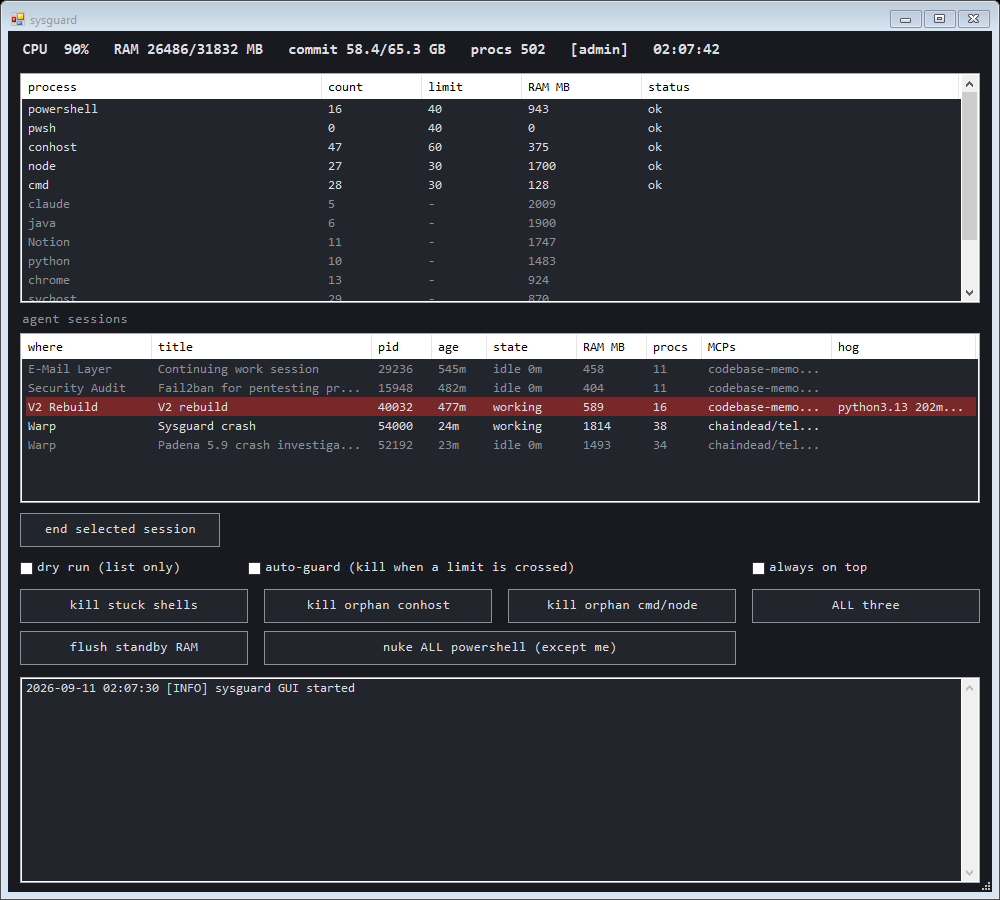

# sysguard

Process-storm guard for Windows. It watches the process families that runaway tooling spawns (`powershell`, `conhost`, `node`, `cmd`), and when a family crosses its limit it kills exactly the processes that are provably dead weight: shells stuck in startup, console hosts whose owner is gone, and orphaned `cmd -> node` trees. It also shows every running AI agent session as one row, with the terminal or workspace it lives in, its title, how long it has been idle, and what it costs in RAM. Three PowerShell files, a WinForms GUI, no dependencies.

[](https://github.com/314159DD/sysguard/actions/workflows/test.yml)
[](LICENSE)




---

## Why it exists

AI coding agents, editor extensions, and MCP servers run on process trees: a `cmd` wrapper starts `node`, which starts another `cmd`, which starts another `node`. When the top of that tree dies (a crashed terminal, a killed session), Windows does not reap the rest. Hooks that spawn a shell per event make it worse: a hook that fires on every tool call across three parallel agent sessions leaves hundreds of 400 KB `powershell.exe` processes stuck in startup, each with its own `conhost.exe`, until the machine starves for CPU and the only way out is the power button.

Task Manager cannot tell a stuck shell from a working one, and killing by name takes down the database behind a `cmd /C` wrapper along with the garbage. sysguard makes that distinction, and can make it while nobody is at the keyboard.

## What it kills, and what it never touches

Three rules, each independently testable against a snapshot of the process table:

| Rule | Target | Evidence |
|---|---|---|
| stuck shells | `powershell.exe` / `pwsh.exe` | older than 30 s **and** working set under 2 MB. A shell that has been alive for half a minute without loading its runtime is not going to |
| orphan conhost | `conhost.exe` | parent process is gone |
| orphan trees | `cmd.exe` / `node.exe` | parent process is gone, plus every `cmd`/`node` descendant of such a process |

Two guarantees sit on top of the rules:

1. **A dead-looking tree that still does real work is protected.** If any process under a candidate is not a `cmd`/`node` helper (postgres behind a `cmd /C` wrapper, a service host, a game launcher), that process, its whole ancestor chain, and everything under the chain are left alone. Only trees made purely of helpers are killed.
2. **PID reuse is handled.** Windows recycles process IDs. A "parent" that was created *after* its child is a different process wearing the old PID, and the child counts as orphaned.

sysguard never kills itself, and every kill goes to `sysguard.log` with name, PID, parent, working set, and command line.

Two extra buttons exist for emergencies: **nuke all powershell** (everything except sysguard) and **flush standby RAM** (purges the Windows standby list via `NtSetSystemInformation`, needs admin).

## Hygiene rules and system alerts

Some of the worst slowdowns never cross a process-count limit. One afternoon on a 96 GB machine the mouse stopped moving: 16 hung `grep`/`tail` processes kept a hard disk at 100 %, 25 throwaway PostgreSQL clusters from test-gate runs had never been stopped (5.7 GB RAM), and a vendor telemetry process had leaked 1.08 million handles, which grew the kernel pools to 19 GB. So the guard also runs these on every tick, limit or not:

| Rule | Target | Action |
|---|---|---|
| stale tools | `grep`, `find`, `tail`, `xargs`, `rg` older than 10 min | killed. Agents run them for seconds; an old one is the leftover of a killed shell |
| stale pg lanes | a postmaster whose data dir lies under one of `pgLaneRoots` and that is older than 120 min | `pg_ctl stop -m fast` (data stays on disk). Clusters outside the configured roots are never touched, and with no roots configured the rule is off |

And it raises an alert (log line plus a popup, at most once per 30 min for the same alert; red in the GUI stats line) when

- a single process holds more than 100,000 handles, which is how a handle leak looks long before it hurts,
- the kernel pools (paged plus nonpaged) exceed 4 GB, normal is under 2 GB and only a reboot gives leaked pool back,
- the commit charge passes 90 %.

## CPU cap for agent sessions

`cpucap.ps1` puts the calling PowerShell into a shared Windows job object (`Local\sysguard-agents`) with a hard CPU cap and below-normal priority. Everything that shell starts afterwards inherits both, so an agent that fans out a full test suite, a type check and a build can take at most the capped share of the machine, and the desktop stays responsive. Priority alone costs nothing while the machine is idle; the hard cap only bites when agents would otherwise take every core.

Wrap your agent command in the PowerShell profile:

```powershell
function claude {
    . 'C:\path	o\sysguard\cpucap.ps1'
    Enter-CpuCap -Percent 80
    $exe = Get-Command claude -CommandType Application | Select-Object -First 1
    & $exe.Source @args
}
```

All sessions share the one job, so the cap applies to all of them together. Set `$env:SYSGUARD_CPUCAP = 'off'` to skip it in a shell.

## Agent sessions

Every `claude.exe` on the machine is shown as one session: the agent process plus everything under it (MCP servers, tool shells, whatever they spawned).

| column | source |
|---|---|
| where | the herdr workspace label when the session runs inside [herdr](https://herdr.dev) (read through `herdr pane list` and `pane process-info`), otherwise the terminal above the agent: Warp, Windows Terminal, VS Code, Cursor, WezTerm, Alacritty, or `detached` |
| title | the console title the agent sets, which for Claude Code is the conversation title. Read by attaching to the session's console for a millisecond (`AttachConsole` / `GetConsoleTitle`), which works under Warp's and herdr's pseudo-consoles alike. Falls back to the folder the agent was started in, read from the process's PEB |
| state | `working` or `idle Nm`. Claude Code prefixes its title with a spinner while working and an asterisk while waiting, so the state is exact when a title is available; otherwise it comes from CPU movement between ticks and from live tool shells under the session |
| RAM MB, procs | summed over the whole tree |
| MCPs | package names parsed from the `npx` / `uvx` / `java -jar` wrappers under the agent |
| hog | the heaviest child over 30 minutes of CPU time or 1 GB of working set, e.g. `python3.13 183m cpu`. Such rows are red |

**end selected session** kills the selected tree from the leaves up, so nothing is re-parented mid-kill, and respects the dry-run checkbox. Nothing about sessions is ever automatic: an idle session is an open conversation, and sysguard only makes it visible and gives you the button.

The stats line also shows the **commit charge** (RAM plus page file). Programs that cannot get memory abort long before RAM itself is full; a Rust terminal, for instance, dies with `0xc0000409` when an allocation fails. If that number is near its limit, the next crash is not a process storm.

## Modes

```
sysguard.bat                   GUI monitor: live families vs limits, agent sessions, kill buttons, dry-run toggle, auto-guard
sysguard-guard.bat             headless guard: 10 s loop, applies the kill rules while a limit is crossed and the hygiene rules and alerts always
powershell -File sysguard.ps1 -Scan       print what the rules WOULD kill right now and the session table, exit
powershell -File sysguard.ps1 -Clean      apply the rules once, exit
powershell -File sysguard.ps1 -Install    register the headless guard as a logon task
powershell -File sysguard.ps1 -Uninstall  remove that task
```

The GUI and the guard are single-instance: a second `sysguard.bat` brings the open window to the front, a second guard exits.

Start with `-Scan`. The stuck-shell rule is a heuristic (age and working set), and a long-lived tiny helper shell on your machine will show up in the dry run before you let the guard loose on it.

## Limits

The guard and the auto-guard checkbox only act while a family is over its limit; below the limits sysguard just watches.

| family | default |
|---|---|
| powershell / pwsh | 40 |
| conhost | 60 |
| node | 30 |
| cmd | 30 |

Override any of these, the stuck-shell thresholds, or the hygiene and alert values (`staleToolMaxAgeMin`, `staleToolNames`, `pgLaneRoots`, `pgLaneMaxAgeMin`, `handleAlertCount`, `poolAlertGB`, `commitAlertPct`) in a `sysguard.config.json` next to the script. Only the keys you set are changed; `sysguard.config.example.json` lists them all.

```json
{ "thresholds": { "node": 50, "chrome": 80 }, "stuckShellMaxAgeSec": 45 }
```

## Run it at logon

```
powershell -ExecutionPolicy Bypass -File sysguard.ps1 -Install
```

registers a Scheduled Task that starts the headless guard at every logon with a 10 s interval, hidden, without elevation. `-Uninstall` removes it. The guard is what protects the machine while you are away from it.

## Tests

```
Install-Module Pester -Scope CurrentUser -MinimumVersion 5.5.0
Invoke-Pester tests
```

77 tests run the rule engine, the hygiene rules, the alerts and the session model against synthetic process tables, plus the CPU cap in child shells: dead chains, protected wrappers, PID reuse, threshold edges, dry-run vs real kills (with `Stop-Process` mocked), config overrides, terminal attribution, MCP name parsing, title glyphs, idle detection over several ticks, hog flags, and kill order. CI runs them on `windows-latest` under both Windows PowerShell 5.1 and PowerShell 7, then does a `-Scan` dry run against the runner itself.

## Project structure

```
sysguard.ps1                  Entry point: modes, logon task, standby flush (P/Invoke), WinForms GUI
rules.ps1                     Rule engine: snapshot, orphan-tree resolution, stuck-shell rule, family stats, config
sessions.ps1                  Session model: agent trees, terminal and herdr attribution, cwd and console title (P/Invoke), idle detection, hogs
cpucap.ps1                    CPU cap: shared job object with hard CPU limit and below-normal priority for agent shells
sysguard.bat                  Launch the GUI (hidden console, STA)
sysguard-guard.bat            Launch the headless guard
sysguard.config.example.json  Every overridable limit with its default
tests/rules.Tests.ps1         Pester suite for the rules
tests/sessions.Tests.ps1      Pester suite for the session model
docs/gui.png
```

`sysguard.log` is written next to the script and rotated to `sysguard.log.1` once it passes 1 MB.

## License

MIT. See [LICENSE](LICENSE).
